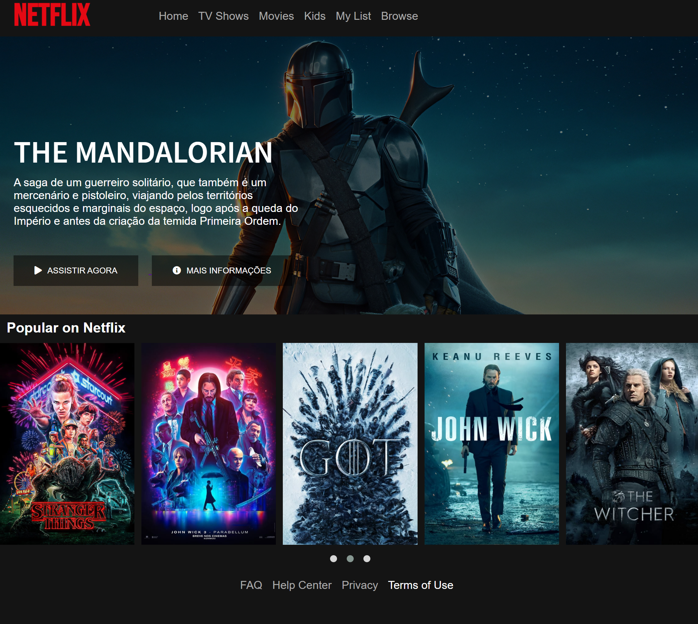

<h1 align="center">
    Netlfix | Clone Project
</h1>

  <a href="#-tecnologias">Tecnologias</a>&nbsp;&nbsp;&nbsp;|&nbsp;&nbsp;&nbsp;
  <a href="#-projeto">Projeto</a>&nbsp;&nbsp;&nbsp;|&nbsp;&nbsp;&nbsp;
  <a href="#-layout">Layout</a>&nbsp;&nbsp;&nbsp;|&nbsp;&nbsp;&nbsp;
  <a href="#memo-licença">Licença</a>

 

  

 

  

## 🚀 Tecnologias

Esse projeto foi desenvolvido com as seguintes tecnologias:

- [HTML](https://developer.mozilla.org/pt-BR/docs/Web/HTML)
- [CSS](https://developer.mozilla.org/pt-BR/docs/Web/CSS)
- [JavaScript](https://developer.mozilla.org/en-US/docs/Web/JavaScript/Reference)

## 💻 Projeto
Recrie a interface do principal site de streaming mundial utilizando tecnologias simples como HTML5, CSS3 e JavaScript. Nesse projeto você aprenderá: como estruturar um layout, técnicas de CSS3 com containers e variáveis, como posicionar os elementos com Flexbox e como utilizar plugins Jquery a favor da sua aplicação.

Foi recriado a interface do prinicpal site de streaming, o Netflix, com o objetivo de fixar os conceitos sobre o HTML5, CSS3 e JavaScript, como layout, posicionar os elementos com Flexbox, tags e como utilizar plugins Jquery a favor da aplicação. :green_heart:

## 🔖 Layout

Foi utilizado como referência a página do [Netflix](https://www.netflix.com/br-en/) quando você já está conectado e navegando. 
Plugin jQuery do [Owl Carousel](https://owlcarousel2.github.io/OwlCarousel2/) 
Bem como alguns elementos visuais do [TMDb](https://www.themoviedb.org/) e também [FontAwesome](https://fontawesome.com)

## :memo: Licença

Esse projeto está sob a licença MIT. Veja o arquivo [LICENSE](LICENSE.md) para mais detalhes.

---

Código feito com ♥ by Bruno durante o bootcamp 'everis FullStack Developer' proporcionada em parceira com a Digital Innovation One. :green_heart: